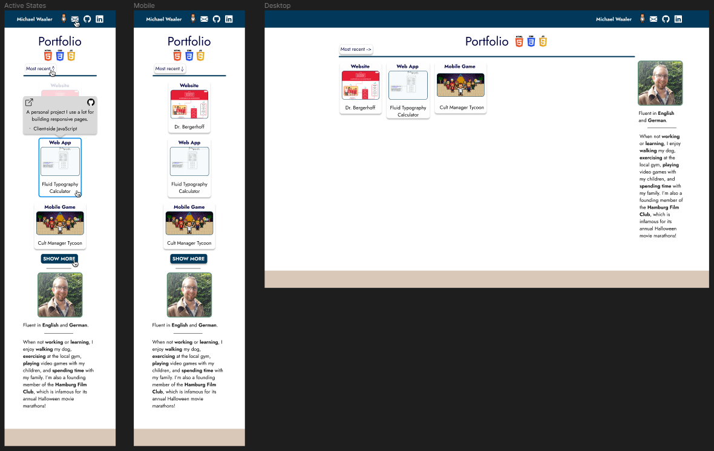

# Portfolio Page

### Objectives
- I wanted to build a simple portfolio page that is easy to update by simply adding the info in a standardized format.
- I wanted a bio section that I could also change/update relatively simply in one place and not have to duplicate changes.  

### Live site

- Live Site URL: [You can visit the page here](https://www.flyingtens.com/Portfolio/)

### Design preview

- 

## My process

### Built with

- Semantic HTML5 markup
- CSS custom properties
- Flexbox
- Mobile-first workflow
- PostCSS (CSS minify, autoprefixer, PostCSS import)
- Dynamic JS  
- BEM notation
- RegEx

### What I learned

- Configuring PostCSS
- Starting to work in a modular fashion (splitting CSS/JS into more manageable specific files)
- This was the first time I used JS to manipulate the DOM.
